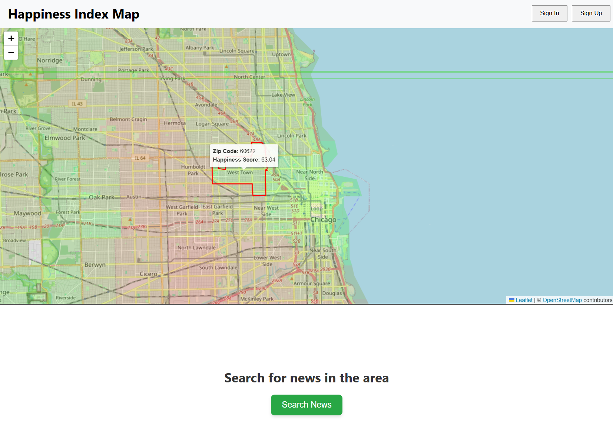

<h3 align="center">Happiness Index Map for Neighborhoods</h3>

   <div align="center">
        Be smart and choose a happier place to live!
    </div>
</div>


## 🤖 Introduction
This project provides an interactive web application that estimates happiness levels across various regions in the United States, down to the zip code level. By utilizing publicly available datasets on factors like crime rates, income levels, housing costs, education levels, etc., the application will provide users with a detailed analysis of happiness in specific areas along with updates on recent news near the selected location. 
</br></br>
Users can interact with a geo-coded heatmap, search for happiness scores by location, and update their own happiness ratings over time via survey questionnaires. Moreover, city officials can utilize the application to get deeper insight into the well-being of their residents and make more precise decisions about the allocation of resources.



## 🔋 Features

👉 **Interactive Heatmap**: Displays the happiness levels colorcoded and allows for more information on hover. </br>
👉 **User Login**: Users can login to see more detailed information and contirbute to the project.</br>
👉 **User Questionnaires**: Users can voluntarily answer a survey and explain their happiness/unhappiness in the neighborhood they live in.</br>
👉 **Crime Rate Statistics**: The application can show statistics on recent crime rates given a zip code. (Limited to Chicago region)</br>
👉 **Minimalistic Design**: Simple, yet informative, for ease of use.</br>


## ⚙️ Get Started
The application can be run locally to get the visuals working. However, a backend server is required to fetch more detailed analytics and news near neighborhoods. To run the app locally, follow the steps below.


1. Clone this repository.
```bash
git clone https://github.com/JaHyoty/Happiness-Index-Map.git
```
2. Install the dependencies for both serv and client side.
```bash
npm install
cd client
npm install
cd .. 
```
3. Run the buil-start command to build a production version and start running the application on localhost.
```bash
npm run build-start
```


## 🚀 Acknowledgements
This applications was built as part of a Database Systems course at UIUC.
Thank you for my teammates for helping in their share of the work.
</br></br>
My contributions focused on:
1. Building the ZIP code dataset
2. Developing a regression model to predict happiness levels
3. Building the front-end for the map and happiness details.
4. Deployment to Google Cloud

Teammates contributions: backend api, user authentication, news search, admin panel, complex sql queries.